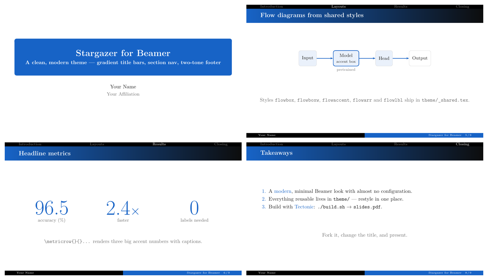

# Stargazer for Beamer

A clean, modern **Beamer** theme: a blue→black gradient title bar, a top
section-navigation strip, a two-tone footer, and a blue rounded title box —
with serif type and a single coherent accent color. It recreates the look of
[touying](https://touying-typ.github.io/)'s *stargazer* theme in plain LaTeX/Beamer,
so you get the modern aesthetic with the full Beamer ecosystem.



## Features

- **Full-bleed gradient title bar** (TikZ shading) on every slide.
- **Top section-navigation strip** that tracks the current section.
- **Two-tone footer** — author · short title · slide number.
- **Blue rounded title box** for the title page and dividers.
- A small kit of **shared macros & TikZ styles** (`theme/_shared.tex`):
  `\acc{}` / `\sub{}` (accent / muted text), `\metric{}{}` and `\metricrow{}`
  (big stat numbers), `\figframe{}{}` (captioned figure), `\placeholder{}`,
  and flow-diagram styles `flowbox` / `flowboxw` / `flowaccent` / `flowarr` / `flowlbl`.
- One coherent palette — change the accent in one place (`SgBlue`).

## Requirements

- **[Tectonic](https://tectonic-typesetting.github.io)** — self-contained XeTeX/LaTeX engine (downloads packages on first run).
- *(optional)* **poppler** (`pdftoppm`) for the per-slide PNG previews.

On macOS: `brew install tectonic poppler`.

## Quick start

```bash
git clone https://github.com/warmspringwinds/stargazer-beamer.git
cd stargazer-beamer
./build.sh            # -> slides.pdf  (+ PNG previews in build/preview/)
PREVIEW=0 ./build.sh  # skip the previews (faster)
```

The first compile downloads packages (~30–40 s); after that it's ~1 s.

## Using it

Edit **`slides.tex`** — it's a normal Beamer deck. The entire look is one line
at the top:

```latex
\documentclass[10pt, aspectratio=169]{beamer}
\input{theme/stargazer-beamer.tex}
```

Set your metadata and write frames as usual:

```latex
\title[Short title]{Full Title}
\subtitle{A one-line subtitle}
\author{Your Name}
\institute{Your Affiliation}

\section{Introduction}
\begin{frame}{A slide}
  \begin{itemize}
    \item Highlight things in the \acc{accent color}.
    \item Add \sub{muted secondary text}.
  \end{itemize}
\end{frame}
```

### Handy macros (from `theme/_shared.tex`)

| Macro | Does |
|---|---|
| `\acc{text}` | accent-color highlight |
| `\sub{text}` | muted gray secondary text |
| `\metricrow{a}{la}{b}{lb}{c}{lc}` | three big accent numbers with captions |
| `\figframe[width]{path}{caption}` | centered figure with a caption |
| `\placeholder[width]{text}` | dashed placeholder box |
| TikZ `flowbox` / `flowaccent` / `flowarr` … | clean flow diagrams |

### Colors

Defined at the top of `theme/stargazer-beamer.tex` — change `SgBlue` to
restyle the accent, gradient, footer, and title box at once.

## Files

| Path | Purpose |
|------|---------|
| `slides.tex` | the demo deck — replace with your content |
| `theme/stargazer-beamer.tex` | the theme (the look) |
| `theme/_shared.tex` | shared macros + TikZ styles |
| `build.sh` | compile (Tectonic) + render previews (poppler) |

## Credits

The visual design recreates the *stargazer* theme from
[touying](https://touying-typ.github.io/). This is an independent Beamer
re-implementation. Built and tested with Tectonic.

## License

[MIT](LICENSE) — use it for anything, no attribution required (though a star is welcome).
